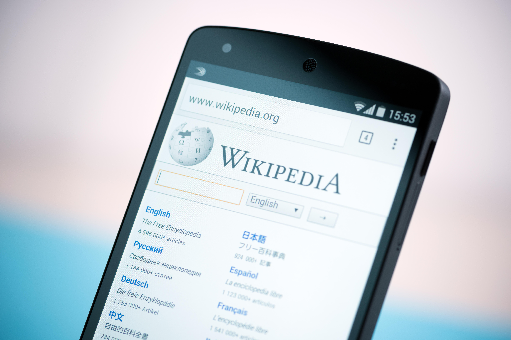

<h1 align="center">Desafio de projeto: site Wikipédia </h1>

    Projeto: Recriar o site da Wikipedia com Layout Moderno. 
    - Aplicar estrutura semântica; 
    - Aplicar estrutura de acessibilidade ; 
    - Inserir; 
    -Formatar os textos do site;

<h1 align="center">
    Site Wikipédia
</h1>

 

  <a href="#-tecnologias">Tecnologia</a>&nbsp;&nbsp;&nbsp;|&nbsp;&nbsp;&nbsp;
  <a href="#-projeto">Projeto</a>&nbsp;&nbsp;&nbsp;|&nbsp;&nbsp;&nbsp;

  

 
<h1 align="center">
    Estrutura
</h1>

  

## 🚀 Tecnologias

Esse projeto foi desenvolvido com as seguintes tecnologias:

- HTML
- CSS
- Git e Github

## 💻 Projeto

Desafio de Projeto DIO: Recriar o site da Wikipédia, e aplicar conhecimentos adiquiridos sobre semântica e acessibilidade.

---

Feito com ♥ by Antonio Pereira